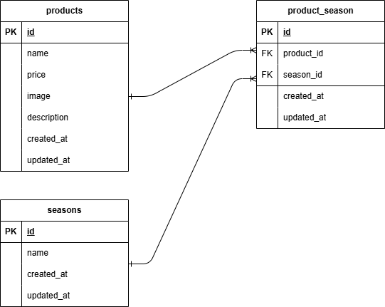

# アプリケーション名
mogitate

## 環境構築手順
1. このリポジトリをクローン  
   `git clone git@github.com:sugamura-aya/mogitate.git`
2. Dockerイメージをビルド  
   `docker-compose up -d --build`
3. PHPコンテナにログイン  
   `docker-compose exec php bash`
4. パッケージインストール  
   `composer install`
5. .env.exampleを.envにコピーして、以下の内容に変更  
   ```env
   DB_HOST=mysql  
   DB_DATABASE=laravel_db  
   DB_USERNAME=laravel_user  
   DB_PASSWORD=laravel_pass
6. docker-compose.yml ファイル内の php: に以下を追記
   ```yaml
   user: "1000:1000"
7. アプリキーの生成  
   `php artisan key:generate`
8. マイグレーション実行  
   `php artisan migrate`
9. ダミーデータ投入（ファクトリ使用）  
    `php artisan db:seed`

## 使用技術・実行環境
このアプリケーションは Laravel と Docker を用いて構築しています。
- Laravel 8.83.29（composer.json 参照）
- PHP 8.1.32（Docker）
- MySQL 8.0.26（Docker）
- Docker / Docker Compose

※より詳細な環境情報は composer.json および docker-compose.yml をご参照ください。

## ER図
※ ER図は下記画像を参照


## URL
- 商品一覧 : /products 
- 商品詳細 : /products/{productId} 
- 商品更新 : /products/{productId}/update 
- 商品登録 : /products/register
- 検索 : /products/search
- 削除 : /products/{productId}/delete

## 実装状況メモ
- 商品一覧画面：完了
  - 商品画像クリックで商品詳細・変更画面へ遷移
  - 「＋商品を追加」ボタンで商品追加画面へ遷移
  - 検索フォームに商品名入力で検索・絞り込み表示
  - 価格順に並び替え選択・結果表示
  - 並び替え条件をタグ表示し、✕で並び替えリセット
  - 商品検索機能と商品並べ替え機能
- 商品詳細更新削除画面：完了
  - 商品一覧画面で商品画像クリックで表示
  - 「変更を保存」ボタンでDBデータ更新し、商品一覧画面へ遷移
  - バリデーション設定済み
  - ごみ箱アイコンクリックでDBデータ削除、商品一覧画面へ遷移
  - 「戻る」ボタンで商品一覧画面に遷移
- 商品登録画面：完了
  - 商品一覧画面で「＋商品を追加」ボタンで表示
  - 「登録」ボタンでDBデータ登録後、商品一覧画面へ遷移
  - バリデーション設定済み
  - 「戻る」ボタンで商品一覧画面に遷移
- ページネーション設定：完了
- 画像アップロード設定：完了
- シンボリックリンク利用：完了
- ダミーデータ用意：完了
- 季節の複数選択設定：完了
